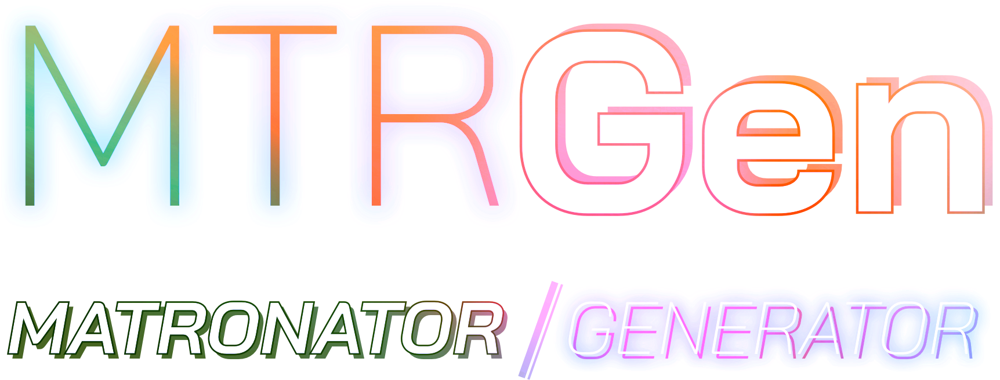

# Matronator/Generator



Automatically generate Entity and related files from the console.

## Instalation

```
composer require matronator/generator --dev
```

#### Troubleshooting

If you get this error when trying to install:

```
matronator/generator dev-master requires composer-runtime-api ^2.2 -> found composer-runtime-api[2.1.0] but it does not match the constraint.
```

Run this command to update composer to the latest version:

```
composer self-update
```

If you can't or don't want to update composer, use version `"^1.0"` of this package as that doesn't depend on Composer runtime API 2.2.

## Usage

You run the script from terminal using this command:

```
# Start interactive utility that walks you through steps to generate files
vendor/bin/mtrgen

# To list all available commands
vendor/bin/mtrgen list

# To see all generate commands
vendor/bin/mtrgen list generate

# To see usage of generate command
vendor/bin/mtrgen generate --help
vendor/bin/mtrgen gen -h

# Generate entity only
vendor/bin/mtrgen generate:entity EntityName
vendor/bin/mtrgen gen:e EntityName

# Generate entity, repo and facade
vendor/bin/mtrgen generate --type=database Name
vendor/bin/mtrgen gen -t database Name
```

#### Generating from config file

You can specify if you want to generate the files from a config by setting the `--config` (or the shorthand `-c`) option to the path to your config file, like this:

```
vendor/bin/mtrgen generate --config=path/to/config/file.yml
```

You can find a sample config file in the `src/` folder under a name `config.sample.yml`. So if you installed this via Composer, it would be in `vendor/matronator/generator/src/config.sample.yml`.

## Roadmap

Planned features for the project. Will be adding features as I think of them.

* [x] Generate files
* [x] Generate files from config
* [x] Generate from templates
* [x] Generate module files
  * [x] BasePresenter
  * [x] Presenter
  * [x] Templates
* [ ] Add global config to customize project structure
  * [ ] Entity Traits to use
  * [ ] Paths to files and configs

## License

MIT License

Copyright (c) 2022 Matronator

Permission is hereby granted, free of charge, to any person obtaining a copy of this software and associated documentation files (the "Software"), to deal in the Software without restriction, including without limitation the rights to use, copy, modify, merge, publish, distribute, sublicense, and/or sell copies of the Software, and to permit persons to whom the Software is furnished to do so, subject to the following conditions:

The above copyright notice and this permission notice shall be included in all copies or substantial portions of the Software.

THE SOFTWARE IS PROVIDED "AS IS", WITHOUT WARRANTY OF ANY KIND, EXPRESS OR IMPLIED, INCLUDING BUT NOT LIMITED TO THE WARRANTIES OF MERCHANTABILITY, FITNESS FOR A PARTICULAR PURPOSE AND NONINFRINGEMENT. IN NO EVENT SHALL THE AUTHORS OR COPYRIGHT HOLDERS BE LIABLE FOR ANY CLAIM, DAMAGES OR OTHER LIABILITY, WHETHER IN AN ACTION OF CONTRACT, TORT OR OTHERWISE, ARISING FROM, OUT OF OR IN CONNECTION WITH THE SOFTWARE OR THE USE OR OTHER DEALINGS IN THE SOFTWARE.
