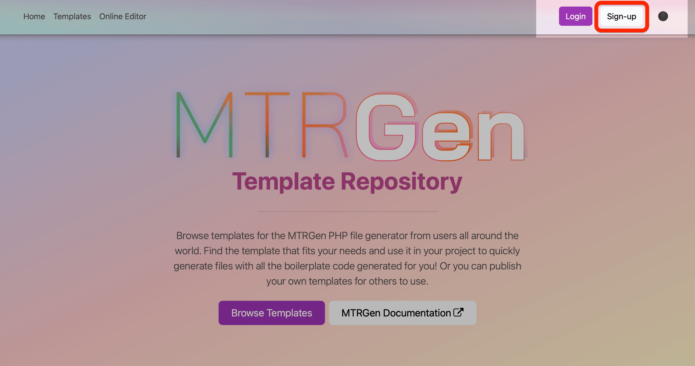
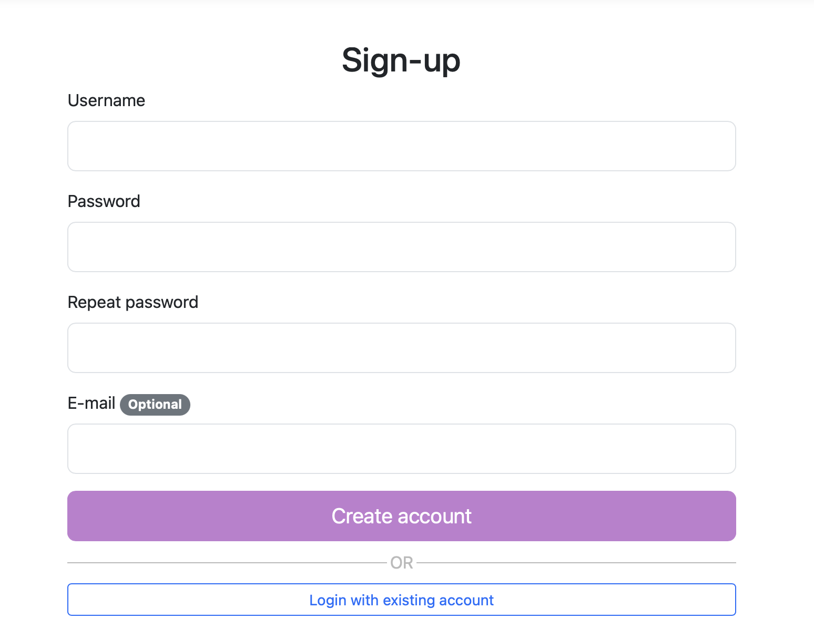
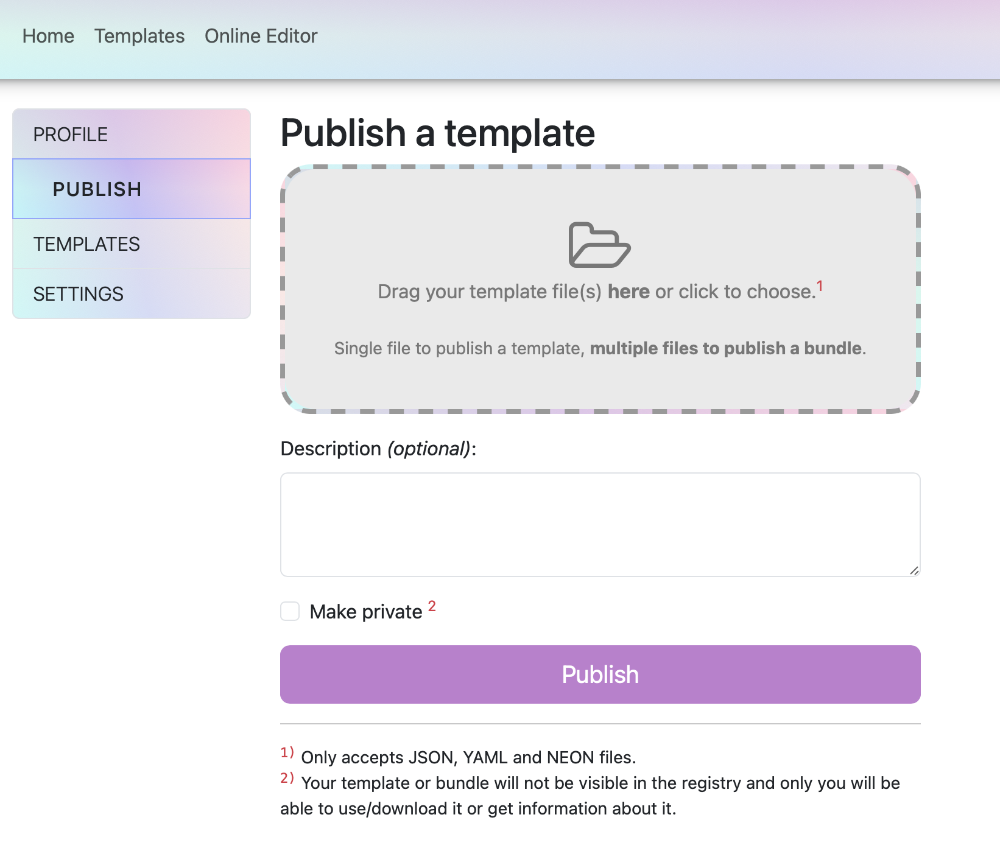

# Publishing templates

Anyone can publish their template to the online registry. All you need is an account and a valid template to publish. Let's walk through the steps of how to publish a template.

- [How to publish a template](#how-to-publish-a-template)
  - [1. Using the CLI tool](#1-using-the-cli-tool)
    - [Using the `signup` and `login` commands](#using-the-signup-and-login-commands)
    - [Publish your template with the `publish` command](#publish-your-template-with-the-publish-command)
  - [2. Using the website](#2-using-the-website)
    - [Create an account and login](#create-an-account-and-login)
    - [Publish your template on the website](#publish-your-template-on-the-website)
- [Template identifier](#template-identifier)

## How to publish a template

You need an account to be able to publish your template online, so the first thing we need to do is to create an account. Then we can publish the template. There are two ways you can do that:

1. Use the CLI tool
2. Use the website

### 1. Using the CLI tool

To create an account using the CLI tool, we'll be using the `signup` command. It takes two arguments - username and a password.

{: .caution }
> The order of arguments matter. Username has to be first and password second. Be careful not to switch them up and create an account with your password for username.

#### Using the `signup` and `login` commands

```bash
vendor/bin/mtrgen signup username password
# Or a slightly shorter syntax
vendor/bin/mtrgen sign username password
```

If no account with the username you provided already exists, your account will be created and you can now login:

```php
vendor/bin/mtrgen login username password
# Or a slightly shorter syntax
vendor/bin/mtrgen in username password
```

This will log you in for 24 hours by default. You can change the duration by providing the `--duration` option (or `-d` for short) with the amount of hours you want to stay logged in. Provide 0 to stay logged in forever (not recommended).

```bash
vendor/bin/mtrgen login username password --duration=48
vendor/bin/mtrgen login username password -d 48
# Or to never get logged out
vendor/bin/mtrgen login username password -d 0
```

Now that your account is created and you've successfully logged in, it's time you finally publish your template.

#### Publish your template with the `publish` command

Publishing a template is as simple as just running a single command:

```bash
vendor/bin/mtrgen publish --path=path/to/your/template.js.mtr
# Or a shorter alias
vendor/bin/mtrgen pub -p path/to/your/template.php.mtr
```

{: .note }
> You can publish templates of any format (modern templates) or legacy JSON/YAML/NEON templates. The template format doesn't matter - as long as it has a valid header, it can be published.

Alternatively if you want to publish a template you already have saved in your local store, just provide the template name instead of the `--path` option, like this:

```bash
vendor/bin/mtrgen publish my-template
```

If you don't provide any arguments/options (name nor path), the program will show you a list of all the templates you have saved in your local store and you can choose a template to publish from that list.

### 2. Using the website

If you don't want to use the CLI tool, you can also create an account using the website.

#### Create an account and login



Just go to [https://mtrgen.com](https://mtrgen.com) and click on the `Sign-up` button in the top right corner. You'll be redirected to the sign-up page where you can create your account.



After your account is created, you can login to the website and navigate to the `Profile` page.

#### Publish your template on the website

On the profile page, navigate to `Publish` using the side menu on the left and there you can upload and publish your template.



And that's it! Your template is now available to everyone (if you didn't set it as private) on the online registry.

## Template identifier

After you publish the template, the identifier for the template will be constructed from your username and the `name` field inside your template file.

{: .note-title }
> Example
> 
> So if your username is `hunter2` and you have set the `name` inside your template to be `my-cool-template`, the identifier under which it will be available to others after publishing will be `hunter2/my-cool-template`.
